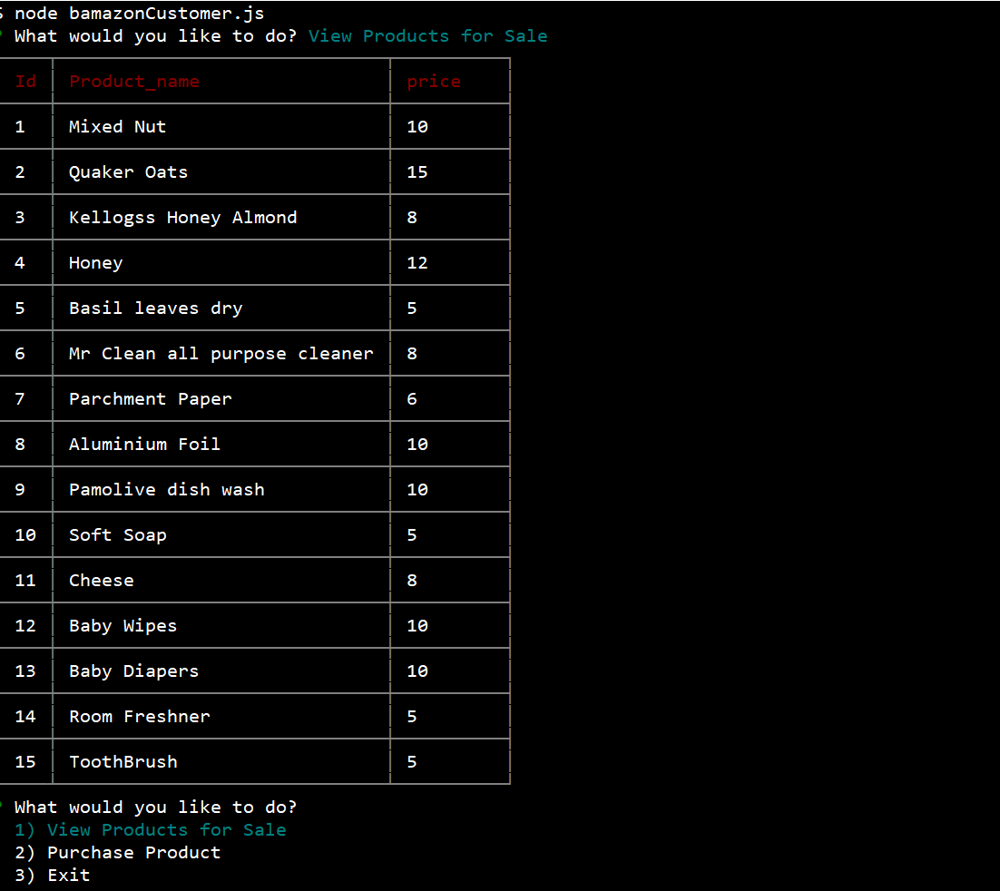
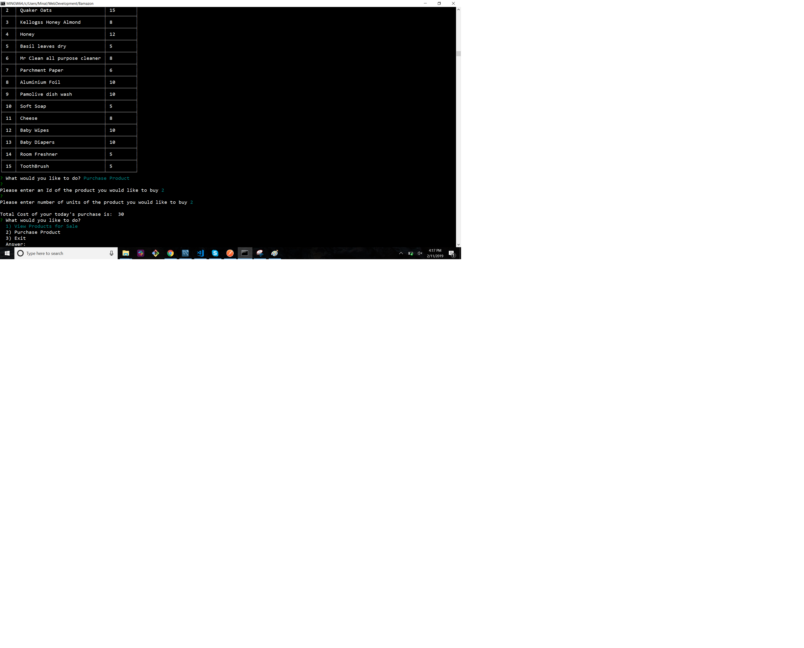

# Bamazon

Bmazon Store The app has 3 options, Bamazon customer,Bamazon manager or Bamazon supervisor.

# Customer

In the customer App, a list of products with their product id, product name, and cost is displayed. The user is then asked if they would like to purchase a product. 

If the user answers YES (Y), the user will then enter the product ID number.The user is then asked how many of the items they would like to purchase.

# Manager
Manager In the Manager App, a manager is given a choice of 4 options: View Inventory, View Low Inventory, Add Inventory, Add New Product.
