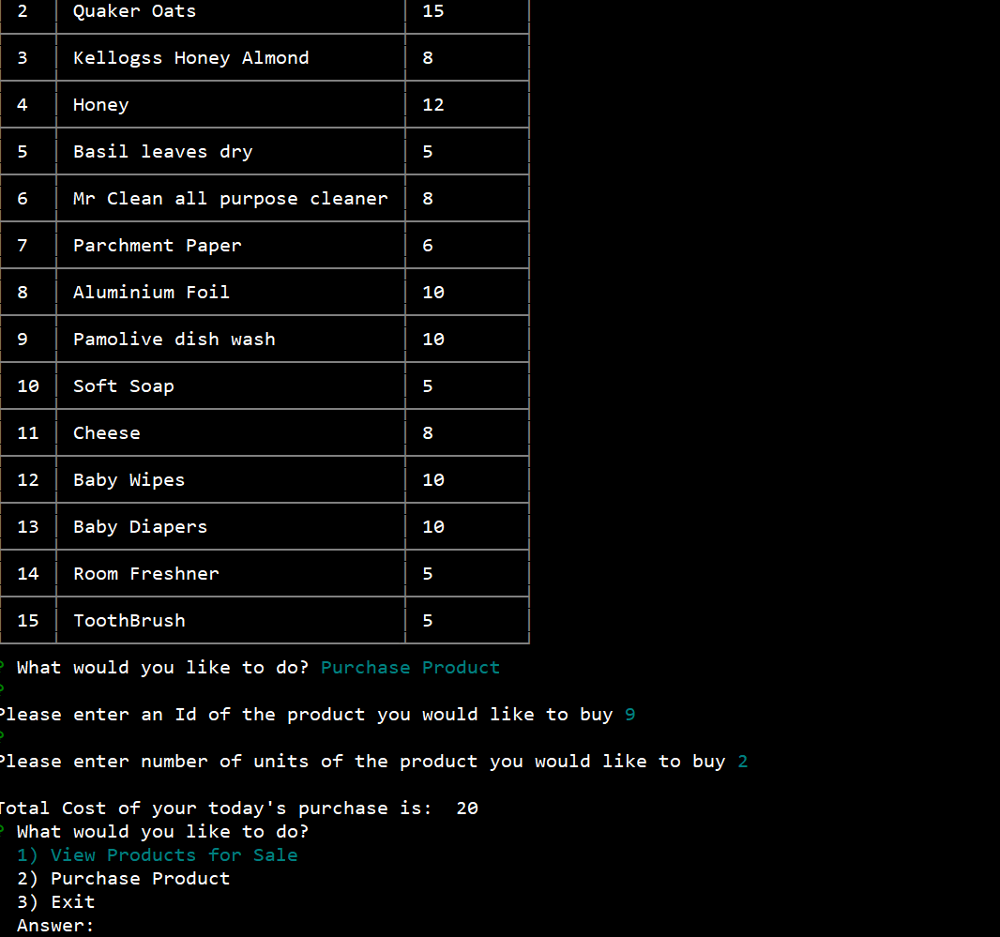

# Bamazon

Bmazon Store has 3 options, Bamazon customer,Bamazon manager or Bamazon supervisor.

### Customer

In the customer, a list of products with their product id, product name, and price is displayed. 
Customer can make purchase by providing product id and quatity to be purchased.

### Manager
Manager is given a choice of 4 options: View Products for Sale, View Low Inventory, Add Inventory, Add New Product.

### Supervisor
Supervisor is given a choice of 2 options: View Product Sales by Department, Add New Department.

